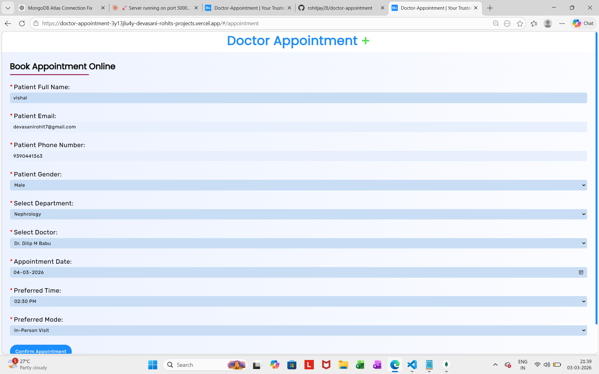
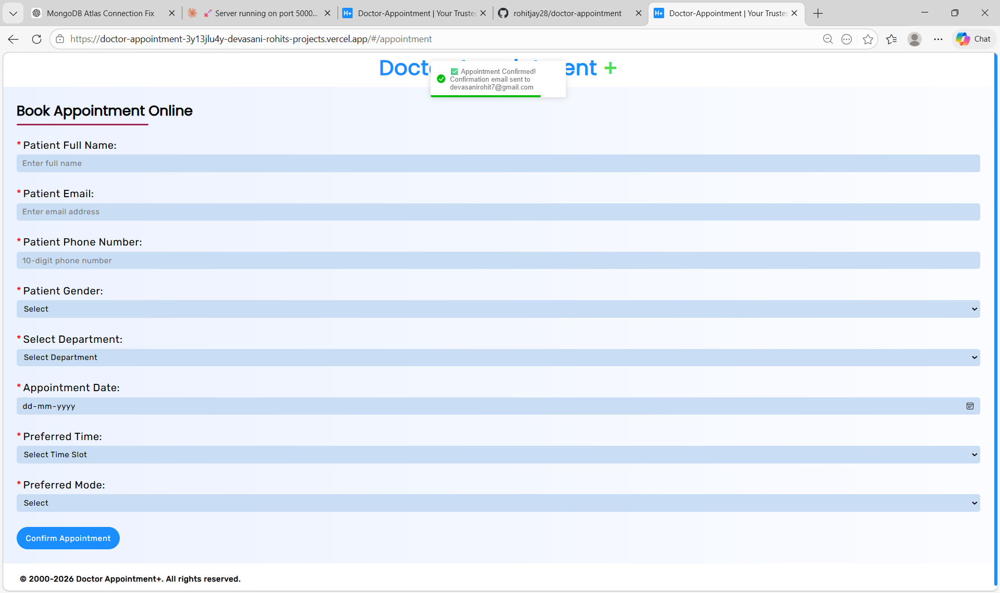
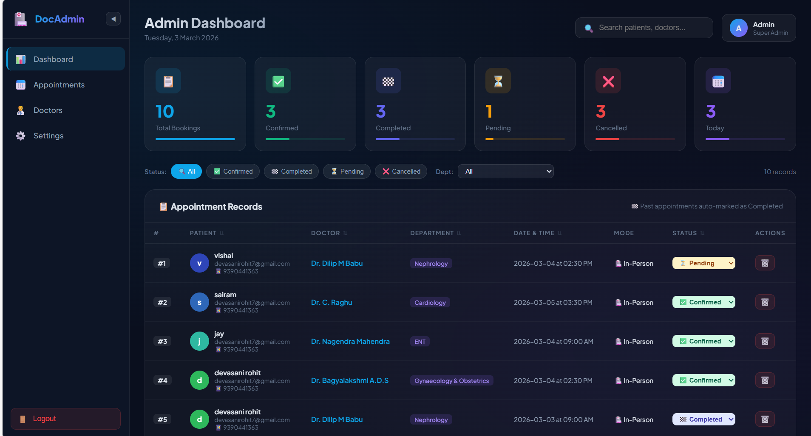
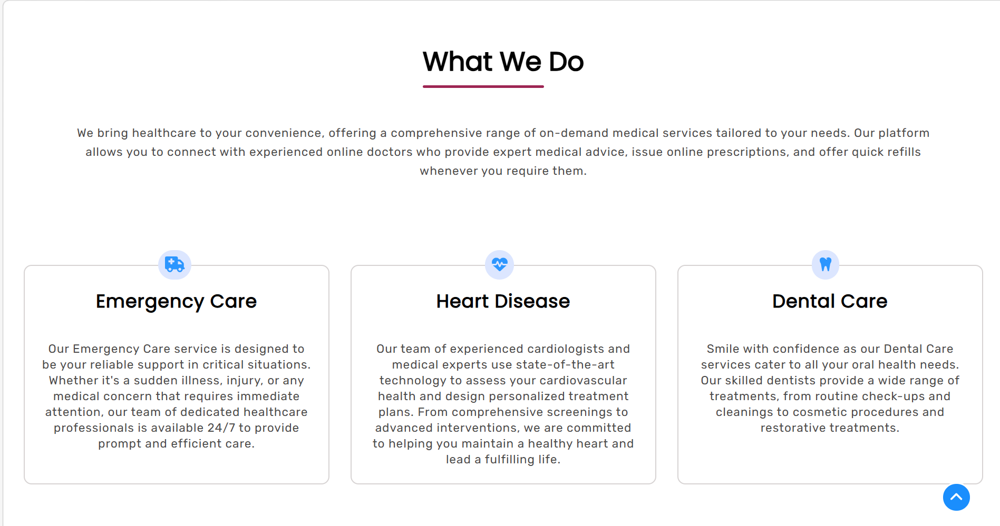
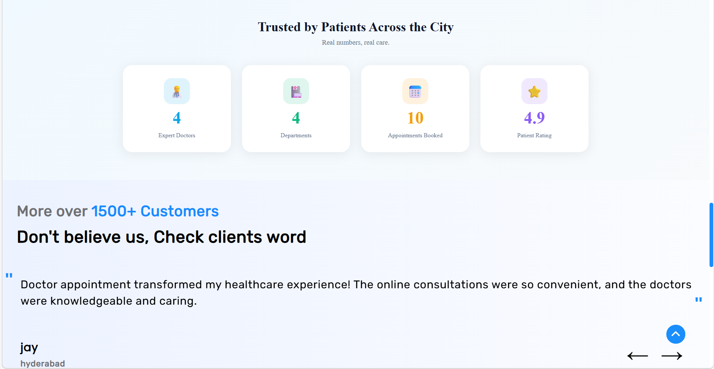
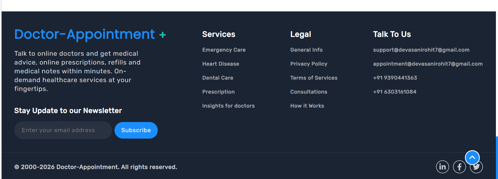

# Doctor Appointment Booking System

A full-stack MERN web application for booking and managing doctor appointments.

## Live Demo

- Frontend: https://doctor-appointment-3y13jlu4y-devasani-rohits-projects.vercel.app
- Backend: https://doctor-appointment-backend.onrender.com/api
- GitHub: https://github.com/rohitjay28/doctor-appointment

## Screenshots

### Home Page

### Book Appointment

### Booking Confirmation and Email

### Admin Dashboard

### Meet Our Doctors

### Services

### About Us

### Why Choose Health

### Reviews and Ratings

### Footer

## Features

### Patient Side
- Book appointments with doctor, department, date and time
- Choose mode: In-Person, Video Call, or Voice Call
- Instant email confirmation after booking
- Reviews and ratings section
- Meet Our Doctors with specializations

### Admin Side
- Secure JWT-authenticated admin login
- Live stats: Total, Confirmed, Pending, Cancelled, Completed, Today
- Sortable, filterable, searchable appointments table
- Update appointment status in real-time
- Delete appointments with confirmation modal
- Auto-completes past appointments
- Department-wise breakdown with progress bars
- Pagination 6 records per page
- Collapsible sidebar

## Full Tech Stack

### Frontend

| Technology | What It Does |
|---|---|
| React.js 18 | Entire frontend UI as functional components |
| React Router DOM v6 | Client-side routing between pages |
| Axios | HTTP requests to backend API |
| React Hooks | useState, useEffect, useCallback |
| CSS-in-JS Inline Styles | Dark glassmorphism admin theme |
| Plus Jakarta Sans | Google Font for typography |

### Backend

| Technology | What It Does |
|---|---|
| Node.js 18+ | JavaScript server runtime |
| Express.js 4 | REST API routes and middleware |
| Mongoose | MongoDB schemas, validation, queries |
| JWT jsonwebtoken | Secure admin token authentication |
| Nodemailer | Confirmation emails via Gmail SMTP |
| bcryptjs | Admin password hashing |
| dotenv | Environment variable management |
| cors | Cross-origin request handling |

### Database

| Technology | What It Does |
|---|---|
| MongoDB | NoSQL document storage |
| MongoDB Atlas | Cloud-hosted production database |
| Local MongoDB | localhost:27017 for development |

### Deployment

| Tool | What It Does |
|---|---|
| Vercel | Frontend hosting |
| Render.com | Backend API hosting |
| GitHub | Version control |

## Key Concepts Applied

| Concept | How Used |
|---|---|
| MERN Stack | Full JavaScript from DB to UI |
| REST API | GET POST PATCH DELETE endpoints |
| JWT Auth | Token-based admin login and route protection |
| CORS | Frontend-backend cross-origin communication |
| Environment Variables | Secrets in .env never hardcoded |
| Async/Await | All DB and API calls with error handling |
| Auto-Status Logic | Past appointments auto-updated on load |
| Real-time UI | State updates instantly without page reload |
| Pagination | 6 records per page with navigation |
| Protected Routes | Redirect to login if JWT missing |

## API Endpoints

| Method | Endpoint | Auth | Description |
|---|---|---|---|
| POST | /api/admin/login | Public | Admin login returns JWT |
| POST | /api/appointments | Public | Book appointment |
| GET | /api/admin/appointments | JWT | Get all appointments |
| PATCH | /api/admin/appointments/:id/status | JWT | Update status |
| DELETE | /api/admin/appointments/:id | JWT | Delete appointment |

## Author

Rohit Devasani
- GitHub: https://github.com/rohitjay28
- Email: devasanirohit7@gmail.com

## License

MIT License

Give it a star on GitHub if you found it helpful!